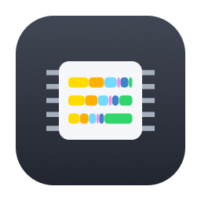
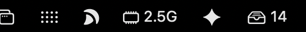
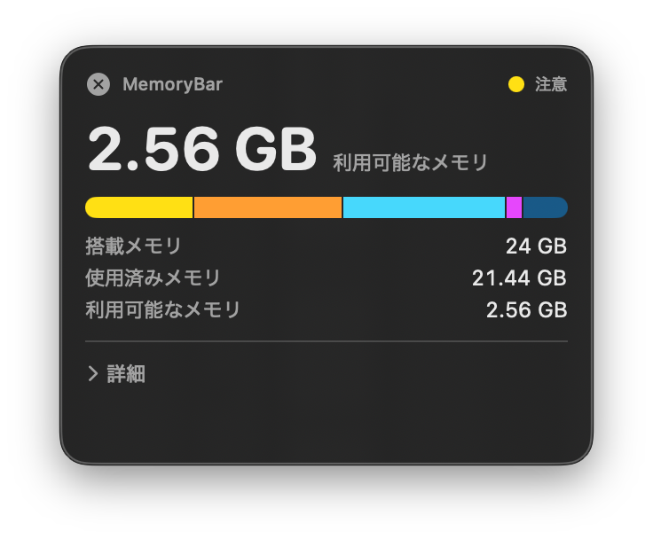
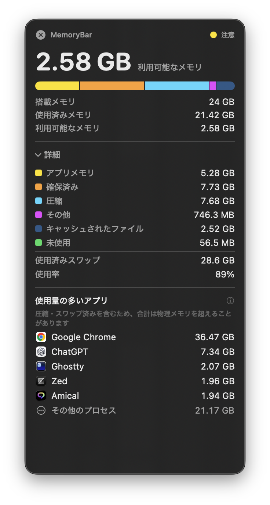

# MemoryBar

**English** | [日本語](README.ja.md)

A macOS menu bar app that shows how much memory is free and how much is in use, in real time, computed with the same formula as Activity Monitor.

[](https://github.com/sugasaki/memorybar/releases/latest/download/MemoryBar.zip)
[](#build)
[](Package.swift)
[](LICENSE)

- Always visible in the menu bar, refreshed about once a second. Pick what it shows — **Available GB / Used GB / Used %** — and the large number in the panel shows the same value
- Compact by default. Open the details section for the breakdown and the apps using the most memory
- A **floating window** for permanent on-screen display (resizable, follows you across Spaces, closes with ×)
- Shows which apps are using the most memory, so you know what to quit
- Checks for updates and applies them on its own
- Swift + SwiftUI, no external dependencies. Measured at about 1% CPU and about 70MB resident

The menu panel and the floating window look identical; only their open/closed state is tracked separately.

> **Note:** the app's own interface is currently Japanese only. This README is available in English and Japanese.

## Screenshots



*In the menu bar — the memory-chip icon and `2.5G`. The value follows the display mode you pick.*

| Compact | Details expanded |
| --- | --- |
|  |  |
| The value you chose, the composition bar, and installed / used / available. The dot at the top right is memory pressure. | The breakdown behind the bar, swap, usage ratio, and the apps using the most memory. |

Shown here as the floating window, which is why it has a close button. The menu bar panel renders the same view and adds a settings section and a quit button below it.

## Install

Download **[MemoryBar.zip](https://github.com/sugasaki/memorybar/releases/latest/download/MemoryBar.zip)**, unzip it, and put `MemoryBar.app` in `/Applications`.

- Universal build — runs on both Apple Silicon and Intel. GitHub Actions rebuilds it on every change to `main`
- To launch it at login, add it under System Settings > General > Login Items

### First launch (once)

The build is ad-hoc signed, so macOS blocks the first launch — **but only if you downloaded it with a browser**. Allow it in any of these ways:

- Right-click `MemoryBar.app` → Open → Open in the dialog
- System Settings > Privacy & Security → Open Anyway
- `xattr -dr com.apple.quarantine /Applications/MemoryBar.app`

Later launches need nothing. In-app updates strip the quarantine attribute as they replace the bundle, so no warning appears.

## Automatic updates

MemoryBar checks for the latest release at launch and every six hours after that. By default it **installs any update it finds and restarts**. If replacing the bundle fails, it restores the previous version and restarts that.

- Turn off "install updates automatically" and an available update is only shown in the panel; it is applied when you press the install-and-restart button
- Turn off "check periodically" to stop automatic checks altogether
- The check button in the panel runs a check at any time
- Log: `~/Library/Logs/MemoryBar-update.log`

**No authentication is involved** and the app holds no token. It fetches releases from the public repository over plain HTTPS. Nothing else to install or configure.

## What the numbers mean

```
Unused    = free_count − speculative
Available = Unused + cached files (external + purgeable)
Used      = physical memory (hw.memsize) − Available

App Memory = internal − purgeable   Wired = wired   Compressed = compressor
Other      = Used − (App Memory + Wired + Compressed)
```

Available — the memory that can be reclaimed — is established first, and Used is derived from it. That way the two always add up to exactly the physical memory installed. The data source is the same Mach API Activity Monitor uses, `host_statistics64`.

Three things are worth knowing when reading these numbers.

**"Other" exists because Activity Monitor's Memory Used is not the sum of its three parts (App + Wired + Compressed).** Measured, it is about 0.73GB larger, and that gap stays nearly constant as memory activity changes. It corresponds to pages the VM does not attribute to any category — kernel and firmware reserved regions, for instance. Showing it makes the breakdown add up to Used on screen.

**Available includes the file cache, so it is an upper bound on "what you can definitely use right now."** The cache is released on demand, but pages not yet written back cannot be freed immediately. For actual pressure, read memory pressure and swap usage alongside it.

**A gap of about 0.15GB from Activity Monitor remains.** Memory Used moves by up to 0.16GB per second, so any difference in sampling time shows up directly. Activity Monitor itself has moments where used + cached exceeds physical memory, which means its display is not a single point in time either — closer agreement is not achievable in principle. The breakdown (App / Wired / Compressed / Cached Files / Swap) matches exactly.

The record of how the formula was verified is in [Issue #24](https://github.com/sugasaki/memorybar/issues/24) (Japanese).

### Apps using the most memory

Each app's number is the sum of `phys_footprint` across the processes belonging to it. This is **the same metric as Activity Monitor's Memory column**, confirmed to match when compared at the same instant.

Helper processes are rolled up into their parent app, so an app with many child processes — Chrome, say — shows as a single row. The lookup walks through processes owned by other users too (the `login` a terminal inserts, for example), and processes under menu bar apps are named correctly.

**The total can exceed physical memory.** `phys_footprint` includes compressed and swapped-out pages; this is not double counting.

Processes owned by other users cannot be read for permission reasons and are not included. Whatever was readable but did not make the top of the list is grouped as "other processes" rather than being silently dropped.

## Build

Requires macOS 14 or later and Xcode (or a Swift 6 toolchain).

```sh
swift build
swift test
swift run              # run directly (lives in the menu bar)
```

To use it as an `.app`:

```sh
scripts/make-app.sh                                   # host architecture only (fast)
UNIVERSAL=1 scripts/make-app.sh                       # arm64 + x86_64 (for distribution)
APP_VERSION=0.9.9 APP_BUILD=42 scripts/make-app.sh    # pin the version explicitly
cp -R dist/MemoryBar.app /Applications/
```

The result is ad-hoc signed. Distributing to third parties additionally requires signing with a Developer ID Application certificate and notarization.

### Versioning

**Git tags (`vX.Y.Z`) are the single source of truth.** CI bumps the patch number and tags on every merge to `main`, so there is nothing to maintain by hand. To raise the major or minor version, run the Release workflow manually and give it a version.

Local builds display the newest existing tag, so they never claim a number that has not been released. A build containing uncommitted changes gets `-dirty` appended to `MBSourceCommit`, which also excludes it from update checks.

### Icon

`scripts/icon/make-icon.swift` generates every size. **The generator is committed, not its output**, so colors and shapes can be changed by editing the code and rebuilding. `scripts/make-app.sh` calls it on every build — no manual step.

At 16px the elements collapse into each other, so that size is drawn separately: no pin, and the bars reduced to three colors.

## Commands for verification

Launch the executable inside the `.app` directly (`swift run` does not produce an `.app`, so update detection cannot be exercised that way).

```sh
dist/MemoryBar.app/Contents/MacOS/memorybar --print           # print one sample
dist/MemoryBar.app/Contents/MacOS/memorybar --apps            # print the top memory consumers
dist/MemoryBar.app/Contents/MacOS/memorybar --check-update    # check for updates only
/Applications/MemoryBar.app/Contents/MacOS/memorybar --install-update   # actually apply
```

Running `--install-update` while the app is resident would replace the bundle it is running from, so **it is refused while MemoryBar is running**. Quit it first.

## About the name

It used to be called TrueMem. That name stated a development claim — "it produces accurate values" — rather than anything from the user's point of view, so it became MemoryBar (2026-08, [Issue #61](https://github.com/sugasaki/memorybar/issues/61)).

Spotlight weights prefix matches heavily, so starting with `Memory` means typing "Memory" already surfaces it. The name is written without a space everywhere, to keep spaces out of paths and URLs.

## Development

Project documentation is written in Japanese.

- Conventions and implementation notes: [AGENTS.md](AGENTS.md) (based on [agent-project-template](https://github.com/sugasaki/agent-project-template))
- Design decisions: [Wiki](https://github.com/sugasaki/memorybar/wiki) — the "why this and not that" you cannot get from reading the code
  - [The panel height problem](https://github.com/sugasaki/memorybar/wiki/%E3%83%91%E3%83%8D%E3%83%AB%E3%81%AE%E9%AB%98%E3%81%95%E5%95%8F%E9%A1%8C) — required reading before touching the menu panel's height (broken five times)
  - [How distribution and auto-update evolved](https://github.com/sugasaki/memorybar/wiki/%E9%85%8D%E5%B8%83%E3%81%A8%E8%87%AA%E5%8B%95%E3%82%A2%E3%83%83%E3%83%97%E3%83%87%E3%83%BC%E3%83%88%E3%81%AE%E5%A4%89%E9%81%B7) — why it moved from private + `gh` to public + unauthenticated HTTPS
  - [Why there is no "free memory" button](https://github.com/sugasaki/memorybar/wiki/%E3%83%A1%E3%83%A2%E3%83%AA%E8%A7%A3%E6%94%BE%E6%A9%9F%E8%83%BD%E3%82%92%E5%AE%9F%E8%A3%85%E3%81%97%E3%81%AA%E3%81%84%E5%88%A4%E6%96%AD) / [UI implementation pitfalls](https://github.com/sugasaki/memorybar/wiki/UI%E5%AE%9F%E8%A3%85%E3%81%A7%E3%81%A4%E3%81%BE%E3%81%9A%E3%81%84%E3%81%9F%E7%82%B9)

## License

[MIT](LICENSE)
